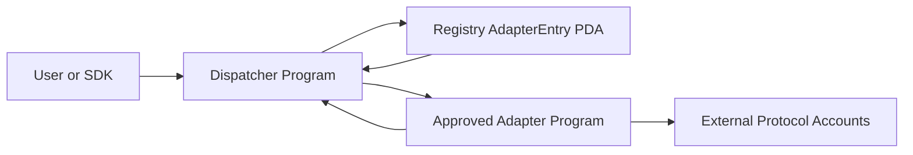

# Solana Yield Adapter Standard

[](https://github.com/pnshr/solYield/actions/workflows/ci.yml)

Reference implementation of a minimal Solana yield adapter standard built
with Anchor `0.31.1` and Solana `2.2.20`: one dispatcher, one
governance-gated on-chain registry, five protocol adapters, mainnet-fork test
harness with committed run manifests, and a live devnet registry deployment.

The standard has three public adapter calls:

- `deposit`
- `withdraw`
- `current_value`

The repo includes a governance-gated registry, a dispatcher that routes only to
approved adapters, a reusable adapter template, real MarginFi USDC, Kamino USDC
direct reserve, Jupiter Perps JLP, Maple syrupUSDC asset-position, and Drift
Insurance Fund request-remove paths, SDK helpers, examples, and mainnet-fork
tooling.

Current status: four of five adapter mainnet-fork tests pass end-to-end
through dispatcher → registry → adapter → protocol (Kamino, MarginFi, Maple,
Drift — see `docs/MAINNET_FORK_TEST_RESULTS.md`; the Drift run uses the
official protocol-v2 v2.161.0 binary built from source because the deployed
mainnet binary removed all user-facing instructions at slot 410,633,860).
Jupiter remains blocked on keeper-gated oracle freshness — a property of
Jupiter's closed oracle loop that affects any implementation — with the real
failing manifest and full root-cause analysis committed. The Maple adapter is
honest syrupUSDC custody with USDC-denominated valuation via Chainlink
(Maple's lending pools are Ethereum-only; no Solana program exists to CPI
into). Registry is deployed to devnet
(`HiLF1P7LguVyBbzMSN3hK4ErGxfxaS6TMPbR6R73Dtdn`) with the Kamino adapter
proposed and approved on-chain (`adapterCount: 1`,
`deployments/devnet/registry.json`). All five fork-test manifests are
committed.

## Architecture



Flow:

1. Governance proposes and approves an adapter in the registry.
2. The dispatcher validates the adapter entry PDA, status, adapter program id,
   requested mint, and nonzero amounts.
3. The dispatcher CPIs into the adapter using the standard account prefix.
4. The adapter validates protocol-specific accounts and performs the protocol or
   token CPI for its documented position model.

## Setup

```sh
npm install
```

Required local tools:

- Anchor `0.31.1`
- Solana CLI `2.2.20`
- Node.js `20+`

`Cargo.lock` is committed intentionally. The Solana `2.2.20` SBF toolchain uses
a Rust compiler that cannot build some newer transitive crate releases, so keep
the lockfile in review and avoid broad `cargo update` changes unless you are
also revalidating `anchor build`.

## Build

```sh
npm run build
```

Equivalent:

```sh
anchor build
```

## Tests

Unit tests:

```sh
npm run test:unit
```

Integration tests:

```sh
npm run test:integration
```

Full Anchor test entrypoint:

```sh
npm test
```

TypeScript validation:

```sh
npm run typecheck
```

## Mainnet-Fork Tests

Generate a validator command and deterministic wallet fixtures:

```sh
MAINNET_RPC_URL=<RPC_URL> FORK_USER_PUBKEY=<ANCHOR_WALLET_PUBKEY> npm run clone:mainnet -- marginfi
```

Start `solana-test-validator` with the printed `commands.validator`, then run:

```sh
npm run test:fork:marginfi
```

The printed validator command includes `--bpf-program` entries for the local
dispatcher, registry, and selected adapter binaries, so run `anchor build`
before starting the fork validator. It also includes `--warp-slot`; override
`FORK_WARP_SLOT` if a protocol account requires testing at a different slot.

Supported fork commands:

```sh
npm run test:fork
npm run test:fork:kamino
npm run test:fork:marginfi
npm run test:fork:jupiter
npm run test:fork:maple
npm run test:fork:drift
```

MarginFi, Kamino, Maple, and Drift have passing dispatcher-driven fork flows
(Drift via the official protocol-v2 v2.161.0 binary built from source — see
`scripts/build-drift-v2161.sh` and the methodology notes in
`docs/MAINNET_FORK_TEST_RESULTS.md`). Jupiter has a typed real CPI path but its
fork test is still blocked by protocol runtime requirements documented in
`docs/INTEGRATION_NOTES.md`. Per-adapter fork status, the reproducible
clone→validator→test procedure, and machine-readable run manifests are tracked
in `docs/MAINNET_FORK_TEST_RESULTS.md` and `tests/mainnet-fork/manifests/`.
Kamino uses direct reserve collateral mint/redeem.
Jupiter targets Jupiter Perps JLP v2 USDC add/remove-liquidity. Maple custodies
pre-existing Solana syrupUSDC and values it in USDC units via the Chainlink
SYRUPUSDC-USDC exchange-rate feed; it does
not fake CCIP mint/redeem. Drift withdraw maps to a request-remove flow because
Drift enforces delayed insurance-fund unstaking.

## Devnet Deployment

Plan the registry deployment commands:

```sh
npm run deploy:devnet:plan
```

Deploy the registry program to devnet and initialize the registry PDA if needed:

```sh
DEVNET_RPC_URL=https://api.devnet.solana.com \
REGISTRY_AUTHORITY_KEYPAIR=~/.config/solana/id.json \
npm run deploy:devnet
```

Flags:

- `--skip-build`
- `--skip-deploy`
- `--skip-init`
- `--print-only`

## Adapter Status

| Adapter | Status | Notes |
| --- | --- | --- |
| Adapter template | Complete template | Mock accounting only; no protocol CPI. |
| MarginFi USDC | Real path implemented | Dispatcher + registry + adapter CPI; fork harness included. |
| Kamino USDC | Real direct reserve path | Reserve deposit/redeem CPI and collateral value math implemented; refreshReserve and queued-withdrawal extensions are documented limitations. |
| Jupiter LP | Real path, fork blocked | USDC add/remove-liquidity CPI, JLP share accounting, and AUM/supply value math implemented. The fork test fails Jupiter Perps oracle freshness because the oracle-refresh path is keeper-gated (`InvalidSigner 6006`), a property of Jupiter's closed oracle loop that affects any implementation. Verified root cause and a reproducible probe are committed (`scripts/probe-jupiter-keeper-gate.js`, `docs/MAINNET_FORK_TEST_RESULTS.md`). |
| Maple syrupUSDC | Real asset-position path | Custodies user-owned syrupUSDC in a PDA vault and returns USDC-denominated value via the Chainlink SYRUPUSDC-USDC feed; CCIP mint/redeem is a documented future extension. |
| Drift Insurance Fund | Real path, passing fork test | `add_insurance_fund_stake` / `request_remove` CPI passes against the official protocol-v2 v2.161.0 binary built from source plus real mainnet state. The deployed mainnet binary removed all user-facing instructions (wind-down, slot 410,633,860), so current-binary execution is impossible for any implementation — fully documented in `docs/MAINNET_FORK_TEST_RESULTS.md`. |

## TypeScript SDK

SDK helpers live in `sdk/ts/src/index.ts`.

They include PDA derivation, registry governance calls, and dispatcher route
helpers:

- `deriveRegistryConfigPda`
- `deriveAdapterEntryPda`
- `initializeRegistry`
- `proposeAdapter`
- `approveAdapter`
- `pauseAdapter`
- `unpauseAdapter`
- `deprecateAdapter`
- `updateAdapterMetadata`
- `transferGovernance`
- `dispatcherDeposit`
- `dispatcherWithdraw`
- `dispatcherCurrentValue`

Runnable examples live in `examples/`.

## Build Your Own Adapter

Start with `docs/BUILD_ADAPTER.md`.

Short version:

1. Copy `programs/adapters/adapter-template`.
2. Keep `deposit`, `withdraw`, and `current_value`.
3. Keep the standard four-account dispatcher prefix.
4. Add protocol-specific accounts after the prefix.
5. Validate every protocol account before CPI.
6. Add compliance, integration, and mainnet-fork tests.
7. Document every unresolved integration detail in
   `docs/INTEGRATION_NOTES.md`.

## Known Limitations

- The registry uses single-key governance for this reference implementation.
- The dispatcher does not understand protocol-specific accounts; adapters must
  validate them.
- `current_value` is standardized as `u64` native mint units, which is simple but
  may need extension for multi-asset positions.
- Maple syrupUSDC supports the Solana yield-bearing token position, not native
  CCIP mint/redeem. The fork test preloads syrupUSDC because real mint authority
  is unavailable.
- Jupiter JLP uses conservative built-in slippage guards because the minimal
  standard does not yet pass caller-specified slippage parameters.
- Jupiter JLP fork deposit is blocked by keeper-gated Doves/Edge oracle
  freshness: on mainnet Jupiter's keepers bundle oracle updates into every
  transaction, and on a fork both refresh paths fail Doves
  `InvalidSigner(6006)` for a non-keeper signer — replaying recorded keeper
  updates and calling the payload-free `UpdateAgPrice2` aggregation
  (`doves/src/contexts/update_ag_price2.rs:32`) alike. The repository does not
  fake oracle data or keeper signatures; full root-cause chain in
  `docs/MAINNET_FORK_TEST_RESULTS.md`.
- Kamino direct reserve `current_value` does not refresh reserve/oracle state,
  and queued withdrawals are not implemented.
- Drift final settlement after the unstaking period is intentionally left as a
  documented future extension; the standard `withdraw` call requests removal.
- Drift insurance-fund staking no longer exists in the deployed mainnet binary
  (wind-down deploy at slot 410,633,860 removed all user-facing instructions).
  The fork test loads the official protocol-v2 v2.161.0 binary built from
  source (`scripts/build-drift-v2161.sh`) over real cloned mainnet state, and
  is labelled as a historical-binary fork in its manifest.
- Mainnet-fork reliability depends on RPC account cloning support and rate
  limits.

