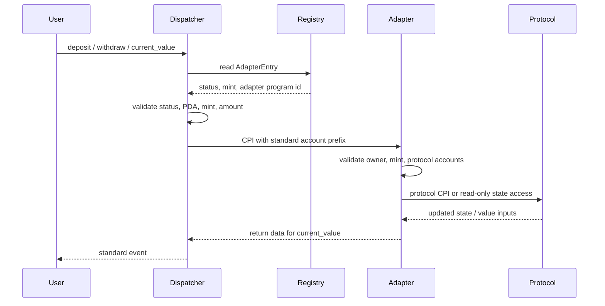

# Architecture Notes

The repository is an Anchor workspace with three layers:

- Registry: governance-gated adapter allowlist.
- Dispatcher: standard route validator and CPI forwarder.
- Adapters: protocol-specific implementations of `deposit`, `withdraw`, and
  `current_value`.

## Component Map

```text
programs/
  dispatcher/
  registry/
  adapters/
    adapter-template/
    marginfi-usdc/
    kamino-usdc/
    jupiter-lp/
    maple-syrup/
    drift-insurance-fund/
sdk/ts/
examples/
tests/
scripts/
docs/
```

## Flow



## Registry Boundary

The registry decides whether an adapter is routable. It does not inspect
protocol accounts or user positions.

Registry writes are governance-only:

- Propose adapter.
- Approve adapter.
- Pause adapter.
- Unpause adapter.
- Deprecate adapter.
- Update adapter metadata.
- Transfer governance.

The reference governance model is a single public key. Multisig or DAO
governance can be layered on by making that public key a governance program or
multisig-controlled signer.

## Dispatcher Boundary

The dispatcher validates only standard fields:

- Adapter entry PDA.
- Adapter status.
- Adapter program id.
- Supported mint.
- Nonzero amount for mutating flows.

It forwards remaining accounts unchanged. This keeps the standard small and
auditable, but it means the dispatcher cannot protect users from a poorly
written adapter. Production adapters must validate protocol accounts internally.

## Adapter Boundary

Adapters own protocol-specific correctness.

Each adapter should:

- Validate owner and supported mint.
- Validate program ids, vaults, markets, banks, oracles, token accounts, and
  authorities.
- Use real protocol CPI or reviewed instruction formats.
- Compute value from protocol state.
- Emit adapter-specific events.
- Return an explicit error for any intentionally unsupported flow rather than
  fake success.

## Adapter Template

The template is intentionally simple. It proves the standard interface and gives
teams a copyable structure. It does not move tokens and does not call protocols.

Template PDAs:

```text
AdapterConfig = [b"adapter_config", supported_mint, version_le_u16]
UserPosition  = [b"user_position", adapter_config, owner]
```

## MarginFi USDC

MarginFi USDC is implemented as the first real adapter path.

Properties:

- User-owned MarginFi account.
- User-owned USDC token account.
- Adapter stores selected MarginFi account and USDC bank.
- Deposits and withdrawals route through dispatcher after registry approval.
- Value is read from MarginFi account shares and bank share value.

Known limitation: the current withdraw health-check set is USDC-only. Multi-bank
MarginFi accounts require additional active bank/oracle accounts.

## Kamino Adapter

The Kamino adapter is a direct reserve supply path:

- User-owned USDC token account.
- User-owned Kamino reserve collateral token account.
- Adapter stores selected reserve and collateral token account.
- Deposits call `depositReserveLiquidity`.
- Withdrawals call `redeemReserveCollateral`.
- Value is read from reserve collateral exchange-rate state.

Known limitations: it does not refresh reserve/oracle state in `current_value`
and does not implement Kamino's queued-withdrawal flow.

## Jupiter Adapter

The Jupiter adapter is a real Jupiter Perps JLP v2 USDC liquidity path:

- User-owned USDC token account.
- User-owned JLP token account.
- Adapter stores selected pool, USDC custody, and JLP token account.
- Deposits call Jupiter Perps `addLiquidity2`.
- Withdrawals call Jupiter Perps `removeLiquidity2`.
- Value is read from user JLP balance, pool AUM, and JLP mint supply.

Known limitation: the minimal standard does not pass explicit slippage
parameters. The adapter uses conservative built-in guards and documents this as
a standard-extension gap.

## Drift Adapter

Drift is implemented as a real request-remove path: `deposit` stakes into the
USDC insurance fund, `withdraw` requests removal, and final token settlement is
left to a future extension because Drift enforces an unstaking period.

## Maple Adapter

Maple is implemented as a Solana-side syrupUSDC asset-position adapter:

- User-owned syrupUSDC token account.
- PDA-owned syrupUSDC vault token account.
- Adapter stores the vault and owner position.
- Deposits transfer syrupUSDC into the vault through SPL Token CPI.
- Withdrawals transfer syrupUSDC back from the PDA vault.
- Value is read from the vault token balance in native syrupUSDC units.

Known limitation: it does not fake direct CCIP mint/redeem or asynchronous
cross-chain settlement. A future CCIP-native Maple adapter should use a new
adapter version and likely model deposit/withdraw as a state-machine flow.

## TypeScript SDK

The SDK is a thin client layer:

- PDA derivation.
- Registry instruction helpers.
- Dispatcher route helpers.
- Current-value simulation helper.

It does not hide protocol account lists. Callers must still pass the correct
adapter-specific remaining accounts.

## Mainnet-Fork Harness

The fork harness has two scripts:

- `scripts/clone-mainnet-accounts.ts`: prints clone and fixture setup.
- `scripts/run-mainnet-fork-tests.ts`: runs all or one adapter fork test.

This keeps judge runs reproducible and keeps skipped tests explicit.

## Design Tradeoffs

- Minimal interface over a large abstraction layer.
- Registry PDA stability over mutable-name lookup.
- Adapter-owned validation over dispatcher protocol awareness.
- Honest documented limitations over fake passing integrations.
- Mainnet-fork tests for real protocol behavior.
